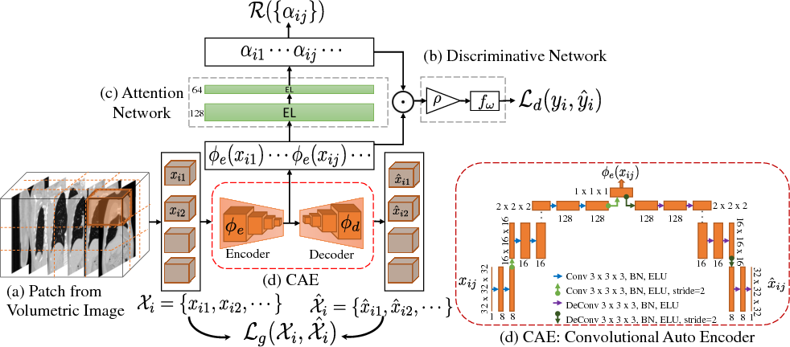

# Subject2Vec

### [TensorFlow](https://github.com/batmanlab/Subject2Vec) | [paper](https://arxiv.org/abs/1806.11217)

Tensorflow based implementation of paper: Subject2Vec: Generative-Discriminative Approach from a Set of Image Patches to a Vector

